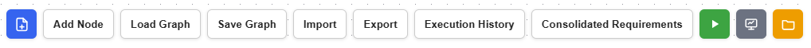

# GUI Interface Guide

By default, accessible at [localhost:8088](http://localhost:8088/).

## Top Menu

{ width="100%" }

From left to right:

- Graph Name: name of currently opened KIT (as a workflow graph)
- Blue icon (new graph): open a new graph and erase the current one
- Add Node: Open a modal window showing the list of all nodes including dataspace assets
- Load Workflow: 

First, take a look at top menu buttons:

- Add Node: Clicking it will show list of nodes including dataspace assets visible to you
  - Asset metadata on the right side panel (toggle button shows the raw metadata)
  - Search textbar on the left top
  - "Genera" section in the list shows "OPERATION" type nodes
  - "DLR dataspace" section in the list shows assets from different providers
  - The window is resizable (bottom left corner)