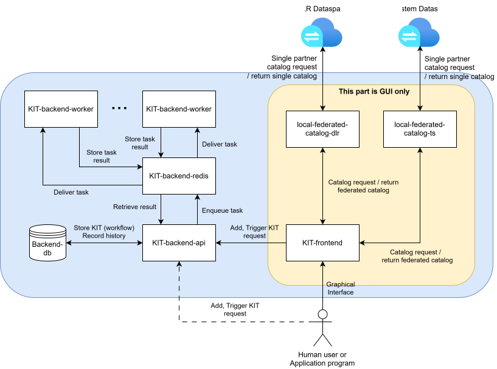

# KIT Framework Software Architecture

## Overview 

The KIT framework includes several software components, and each of them is a Docker container.

- Backend API Server
- Backend Worker
- Backend Redis
- Backend Database (PostgreSQL)
- Frontend GUI
- Local Federated Catalog Service (DLR)
- Local Federated Catalog Service (T-System) -- currently not available WIP

{ width="100%" }

### Backend API Server

This is the heart of our KIT framework. 
It provides UI for headless runtime, and orchestrates all the backend operations based on the user request.

It provides two main REST API endpoints:

- POST `/workflows`, which will save KIT in the Backend database.
- POST `/execution/request`, which will create an excution instance for the specified KIT in the Backend database.

All the endpoints reference listed at [http://localhost:8080/docs#/](http://localhost:8080/docs#/).

API server also process the user's KIT to identify parallelly executable nodes.
This is done by using the fact that KIT is a DAG graph; therefore, API server uses the topological sort algorithm.
Based on this information, each node's execution is orchestrated over one or more Backend Workers. 

### Backend Worker

It is a worker unit who receives the execution task from the API server during the KIT execution.
It is implemented by using Celery Executor.
In our KIT framework, users can spawn up to four worker units, minimum one.

### Backend Redis

This is the message broker between API server and the workers.

### Backend Database

This is PostgreSQL database server for internal use. It is used to save KITs and also track the execution history.

### Frontend GUI

The GUI provides graphical tools to create and edit the KIT graph, along with the export to JSON feature. It is implemented using React in Javascript.

### Local Federated Catalog Service (DLR)

Given predefined dataspace users, we aggregate their catalog to create the local federated catalog. 
Basically, it is a list of all the assets your dataspace connector can see.
The KIT creation and customisation uses the federated catalog to search and utilise them in your KIT.
The local federated catalog service runs the catalog aggregation at a regular time interval (default 1 minute).

---

## Headless Runtime

Running the KIT framework headlessly only excludes Frontend GUI.