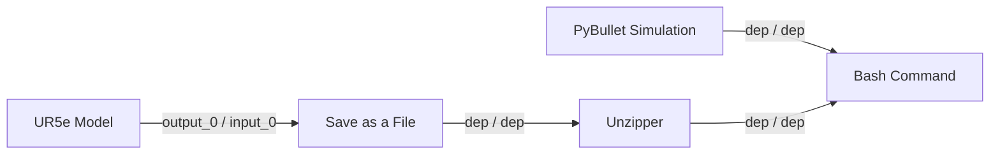

# Getting Started - 2. KIT Creation

In this guide, we will create a simple KIT: *customisable robot arm 3D simulation*.

We will use the following tool(s):

- [KIT framework (Github repository)](https://github.com/rox-architecture/kit-framework-deployment)

This example uses only the assets already exist in the dataspace (i.e., you don't need to create any asset)

## Preliminary Requirement

- KIT framework is installed (completed the [Installation guide](../installation.md))

## Important Notes

- The KIT as a graph representation can be found in [Graph Specification](../documentation/graph-specification.md). With this, you or your robots can also programmatically create a KIT on-the-fly by generating the graph JSON without GUI.
- Requirement specification language used to specify asset and KIT requirements are explained at [Requirement Specification](../documentation/requirement-specification.md)
- List of available nodes can be found in [Available Nodes List]()

## Video Guide

A video guide corresponds to the written instructions below. 

- **Warning**: the video does not show the pybullet_sim node parameter setting. For this part, check the written instruction below.

<div style="position:relative;padding-bottom:56.25%;height:0;overflow:hidden;">
  <iframe
    src="https://www.youtube.com/embed/900Frs03SZI"
    style="position:absolute;top:0;left:0;width:100%;height:100%;"
    frameborder="0"
    allowfullscreen>
  </iframe>
</div>

## Written Guide

To start with, access the GUI at [localhost:8088](http://localhost:8088/). 

### Step 1. Adding Nodes

In the first look of GUI, you see an empty canvas where we can draw a graph with nodes and edges.

First, take a look at the top menu buttons and click "Add Node".

You will see a list of nodes including dataspace assets from various providers (in the dataspace).

Find and add the following nodes, and set their parameters (after adding a node into the graph, click the cog button under the node):
- ur5e_simulation_model.zip
  - No parameter to change
- Save as a File
  - `file_path` = robot/robot.zip
- Unzipper
  - `target_zip` = robot/robot.zip
  - `extract_directory` = robot
- pybullet_sim_empty_env.tar
  - `representation` = docker_archive
- Bash Command
  - For `command`, copy the below docker run command

```shell
docker run --rm \
  --mount type=bind,src="${ARTIFACT_HOST_ROOT}/robot/",dst=/robot,readonly \
  --mount type=bind,src="${ARTIFACT_HOST_ROOT}",dst=/output \
  robotarm-simulator:poc
```

You need to negotiate asset for the first time using it. Also, when you negotiate, close and reopen the `Add Node` window.

Overall, we download the UR5e robot model, and save it at `robot/robot.zip`. Then, we unzip it to `robot` directory because the simulation container will need to read the robot model from this directory.

For the pybullet simulation container to operate, its parameter `docker_archive` indicates that this container image is a .tar file produced by `docker save`. In the KIT framework, this is automatically handled by `docker load` in the backend.

For the Bash Command node parameter, you can use `{ARTIFACT_HOST_ROOT}` which is the local workspace for the KIT framework. It is set in the .env file in the software installation setup. Dataspace assets are saved into this workspace (as the root). Basically, the `robot` directory is located at this root. Therefore, the docker run command here mounts the UR5e 3D model and also mounts the output directory where the simulation video will be produced.

In the graph, notice that UR5e model and pybullet are `FILE` and `CONTAINER` type, respectively. These are the nodes for dataspace assets.

`OPERATION` type nodes are locally running nodes for small post processing of the assets such as compressing, extracting, moving files, saving into a file, etc.

### Step 2. Connecting Nodes

Now, connect the nodes as below:



Note that the edge label in `X / Y` format means that X output port is connected to Y input port.

`dep` indicates order dependency between nodes. For example, Unzipper cannot start before Save as a File (obviously, you need a Zip file before unzip it).

UR5e model node retrieves the model binary data from dataspace and pass it to Save as a File node for saving.

### Step 3. Save KIT and Export

Click the `Save Graph` button on the top menu to save your KIT. Give a reasonable name to your KIT graph.

Export button will serialize your KIT graph into JSON, and produce a json file. This file is used for import by other users.

### Step 4. Requirement Check

KIT consolidates the technical requirements of all the assets contained inside it. Conflicting requirements are also detected.

Click `Consolidated Requirements` button on the top menu. For this example, there is no particular hardware and software requirements.
The dataspace requirements shows which assets need negotiation in your KIT. Their values are written in `provider_id.asset_id` format.

You cannot edit the requirements in GUI. It is because the dataspace requirements are automatically generated. 
On the other hand, the hardware and software requirements are read from the asset metadata in the dataspace.

### Step 5. Dry-Run

You can test your KIT for dry-run. For this part, read the next tutorial: [Running a KIT](../getting-started/kit-run.md).


