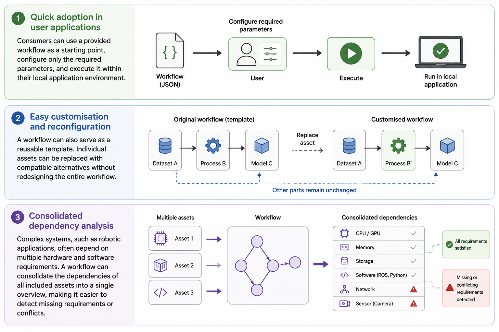

# Introduction - Digital Ecosystem and KIT

In dataspace, each asset represent a single artifact such as:

- File (e.g., image, text, 3d model, document, binary, etc.)
- Container (e.g., docker container)
- Service endpoint (e.g., API response data, data streaming)

Generally, assets are used together. 
For example, a simulation container asset can load 3d model assets, or multiple dataset assets with different classification categories can be combined into one training dataset for AI models.

Then, how do you know what assets to use together? and how to setup them correctly?
For instance, a digital twin simulator requires 3d models (another assets) to be placed in the `/models` directory, or sometimes `/assets` directory.
How do you know what is the correct setup?
This is the purpose of KIT!

KIT is a specific setup configuration designed by the person who knows the assets well (e.g., asset owners)
KIT tells you:

- what dataspace assets do you need to access?
- where the files should be placed?
- how the containers should be stored? (e.g., registry, docker)
- Where the service endpoint response data be sent to?
- What is the summary of total requirements for all these assets?

With KITs, required assets are setup in your application system as intended by the asset provider.
It saves you from manually searching and accessing the required assets, and finding information on how to setup these.

## KIT Workflow

Step 1. Providers create individual assets in the dataspace. These assets are modular, and the metadata contains the semantic model.

Step 2. KIT is created using the assets in the dataspace. KIT is visualised as a graph and serialized to JSON.

Step 3. KIT is distributed to the end users as a dataspace asset or other transfer methods like Git, Email, etc.

Step 4. KIT is executed. Here, "execution" is limited to dataspace asset access and setup. 

Step 5. If new data is generated (e.g., by accessing services), a new asset can be created to enrich the dataspace.

## KIT Benefits

The KIT brings three main benefits:

As KITs collectively access all the required assets and setup them correctly
