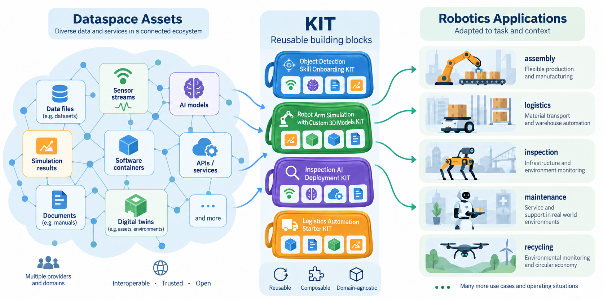
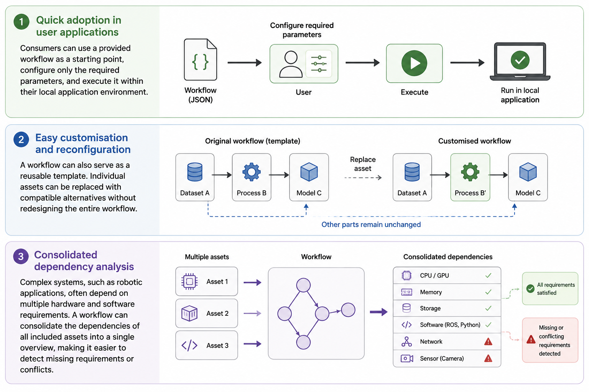
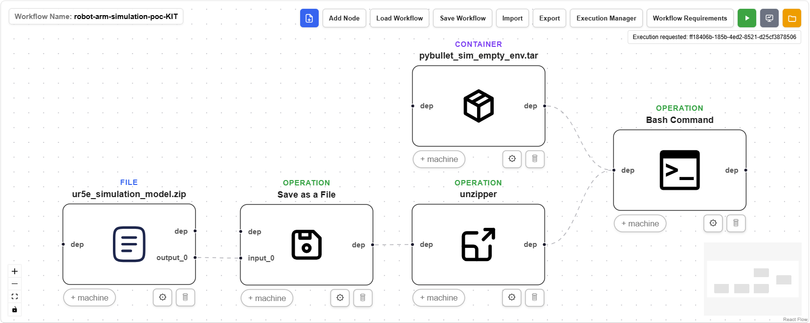
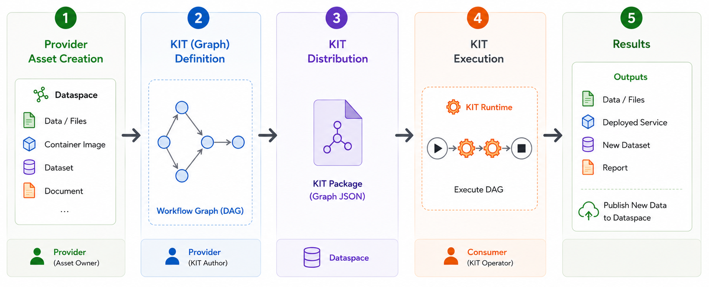

# Digital Ecosystem and KIT (Keep-It-Together)

You can read the below sections to learn about the RoX KIT concept.
Otherwise, you can directly jump to the [Software Installation](installation.md) and [Getting Started](./getting-started/asset-creation.md) pages.

## Introduction

The RoX KIT framework allows modular dataspace assets to be bundled and used as a single package.

At its core, a **KIT is a manifest file** that specifies a set of dataspace assets to be accessed or downloaded altogether. 

KIT also includes reconfigurable parameters (such as PATH or port numbers) and post-actions after downloading files, data, and containers (e.g., moving files to a certain directory).
In this way, providers can design KIT for the default setup, and consumers can reconfigure them to fit into their systems, if necessary.

Thanks to our KIT framework, users do not have to search for relevant dataspace assets individually or figure out how to set them up for use in their application systems.

Below image illustrates our KIT concept on how the modular and generic assets in the dataspace can be organised into KITs, then used for specific robotics application.

Our KIT framework includes a GUI for visualizing and editing KITs, as well as a backend for executing them.

**Executing a KIT means that** the backend automatically handles the negotiation and transfer of dataspace assets using dataspace API.

**Providing a KIT means that** creating a ready-to-use package consisting of dataspace assets, tailored to a specific use case. It can also include predefined post-actions after downloading assets, e.g., moving to the desired directory.

**Consuming a KIT means that** running the KIT using our backend, with possible parameter customisation and even replacing dataspace assets. 
The results of running a KIT include dowloading data, files, and containers from the digital ecosystem and putting them in desired directories and locations to be used in the application system.

## What's the benefit?

Three main benefits of using KITs:

### Additional benefits include:
- The framework automatically handles dataspace negotiation and data transfer.
- It provides built-in asset preparation features for setting up files, containers, and other artifacts in the local environment.
- It provides asset search functionality based on the RoX semantic model, helping users find suitable assets for substitution or reuse.

## How does a KIT look like?

A KIT is defined as a graph with nodes and edges (for GUI), which is serialised into JSON (for headless).

- **Node**: a dataspace asset (or an operational unit)
- **Edge**: dataflow (or dependency indication)

Below image describes an example KIT for robot arm simulation in our KIT framework GUI. 

You can notice that there are `FILE` and `CONTAINER` type nodes (indicated at the top of each node). These represent dataspace assets. Also, there are three `OPERATION` type nodes representing post-actions. 

By executing this KIT, UR5e robot simulation model asset is accessed, saved as a file, and unzipped at the target directory. Meanwhile, Pybullet simulation engine container is pulled. When both the container and model files are processed, the Bash command node triggers `docker run` to start the simulation.

## Scope of our KIT framework

The scope of the KIT framework is limited to:

- Creating and searching dataspace assets based on the RoX semantic model (RoX RODEOS).
- Creating, executing, and customising a KIT (RoX KIT)

In the essence, KIT focuses on the interface with digital ecosystem using dataspace API.
KIT is **NOT** intended to be used to replace any robot system logic or act as an orchestrator of a system.

## KIT Framework Lifecycle

The KIT framework workflow starts with providers registering individual assets in the dataspace. During asset registration, RODEOS can be used to automatically generate semantic metadata based on the RoX semantic model.

#### Step 1. Register individual assets
Providers register modular assets in the dataspace. Each asset is assigned an asset ID and described with semantic metadata, which can be generated with the support of RODEOS.

#### Step 2. Create a KIT
A KIT is created by referencing the asset IDs of the registered dataspace assets. Providers can create and edit the KIT using the framework GUI or directly define it as a serialized JSON file.

#### Step 3. Distribute the KIT
The resulting KIT is delivered to consumer users. The KIT itself can also be distributed as a dataspace asset.

#### Step 4. Execute the KIT
The consumer executes the KIT using the framework backend. The backend accesses and transfers the referenced dataspace assets and prepares them within the consumer's application system according to the structure and operations specified in the KIT.

#### Step 5. Enrich the dataspace
Data or artifacts generated during KIT usage can be registered again as new dataspace assets. These assets can then be used to create new KITs or to extend and evolve existing ones.
