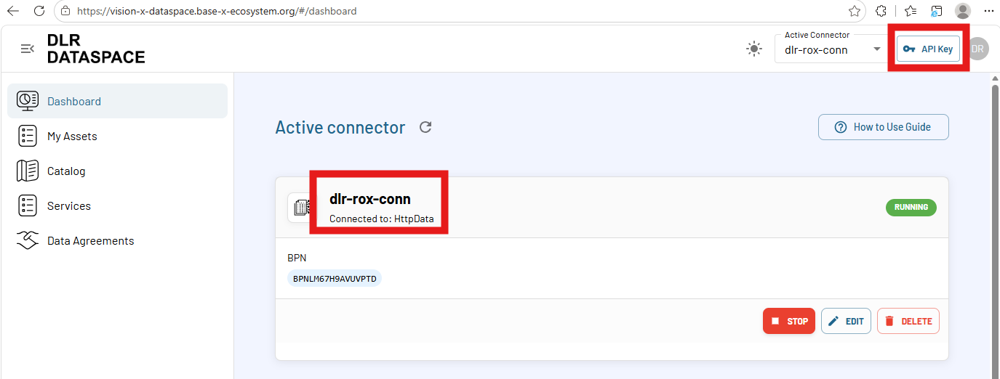

# Installation Guideline

**Requirements**:

- Have a user account for [DLR dataspace](https://vision-x-dataspace.base-x-ecosystem.org/#/home).
- Git and Docker are avaialble on your machine.

Pull the [KIT framework Github repository](https://github.com/rox-architecture/kit-framework-deployment.git):

```shell
git clone https://github.com/rox-architecture/kit-framework-deployment.git
cd kit-framework-deployment
```

Below video shows the installation process. Alternatively, written instructions are provided in the following sections.

## Installation Video


<div style="position:relative;padding-bottom:56.25%;height:0;overflow:hidden;">
  <iframe
    src="https://www.youtube.com/embed/VEJqenw9Lvg"
    style="position:absolute;top:0;left:0;width:100%;height:100%;"
    frameborder="0"
    allowfullscreen>
  </iframe>
</div>

---

## Written Instructions

### Set environment variables (.env)

In the folder, rename the `.env.example` file to `.env` file.
```shell
cp .env.example .env
```

In the `.env` file, set the below environment variables.

- BASE_URL_DLR_CONNECTOR
- API_KEY_DLR_CONNECTOR
- DOCKER_SOCKET_HOST
- ARTIFACT_HOST_ROOT

`BASE_URL_DLR_CONNECTOR` and `API_KEY_DLR_CONNECTOR` variables are needed for connecting to the DLR dataspace connector.
To know these values, first login to [DLR dataspace web UI](https://vision-x-dataspace.base-x-ecosystem.org/). 
Then, find the connector name and the API Key button as indicated in the image below.
If you haven't yet created a connector, then create an HttpData type connector.

{ width="100%" }

`BASE_URL_DLR_CONNECTOR` value in the example above is:

- https://vision-x-api.base-x-ecosystem.org/connectors/dlr-rox-conn

`API_KEY_DLR_CONNECTOR` value should look like:

- sk-...

`DOCKER_SOCKET_HOST` is the host machine Docker socket required for handling container type dataspace assets. To know your socket path

```shell
echo $DOCKER_HOST
```

Given the output is something like `unix:///var/run/docker.sock`, then `DOCKER_SOCKET_HOST` value is:

- /var/run/docker.sock

`ARTIFACT_HOST_ROOT` is the directory where you want to store all the dataspace assets from KITs.
By default, the value is:

- /home/dataspace/artifacts

---

### Run the KIT framework

#### Run With GUI

```shell
docker compose --profile gui pull
docker compose --profile gui up -d
```

Later, if you want to stop:

```shell
docker compose --profile gui down 
```

#### Run without GUI (headless)

```shell
docker compose pull
docker compose up -d
```

Later, if you want to stop:

```shell
docker compose down 
```

### Check everything is running correctly

1. Access GUI: [http://localhost:8088/](http://localhost:8088/)
2. Access backend API: [http://localhost:8080/](http://localhost:8080/)
3. Access federated catalog: [http://localhost:8000/catalogs](http://localhost:8000/catalogs)


